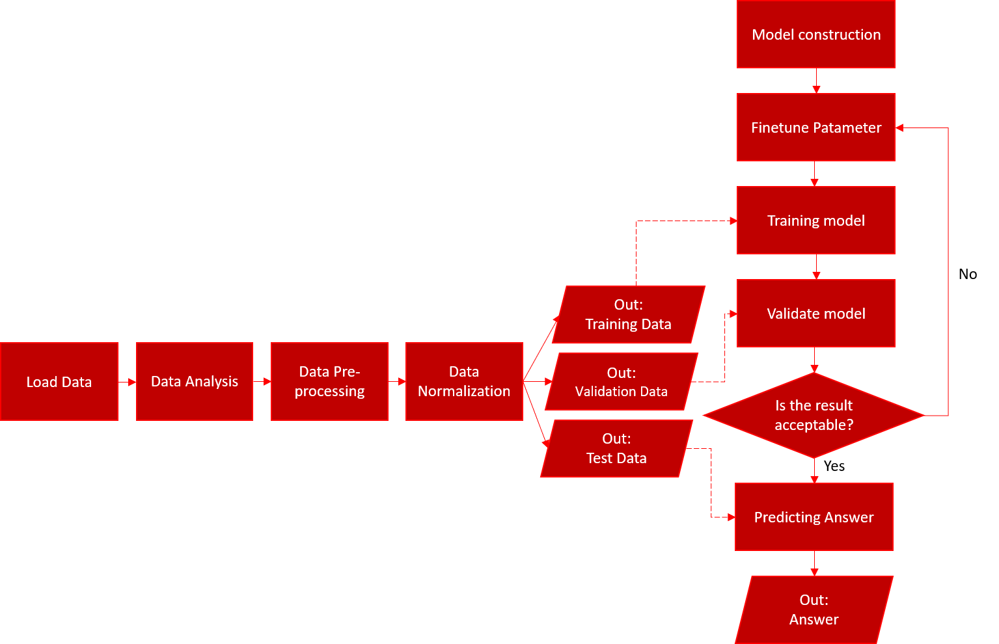
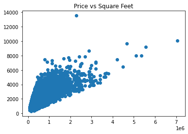
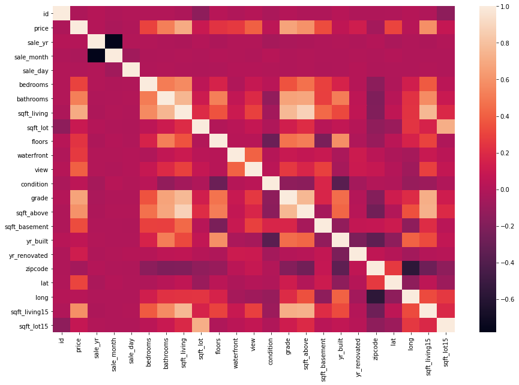

[](https://classroom.github.com/online_ide?assignment_repo_id=3711633&assignment_repo_type=AssignmentRepo)
# Regression Report_109368011

## 1.作法說明

本次作業利用google colab來完成，所有的訓練、驗證、測試資料也都上傳至google雲端硬碟，最後將預測答案從colab下載下來後上傳至kaggle。

notebook link(google colab):https://colab.research.google.com/drive/1but2ZtuVCLP44UhUYYdy1dE_RCUZBoQ9?usp=sharing
1. 首先利用python中的Panda套件，將資料讀取成dataframe，並利用matplot將price與各項資料的關係圖畫出來，來觀察各資料標籤與價錢的關係，並決定是否替除部分標籤，但經過測試，丟去任何資料後的結果均會使預測誤差增加，因此最後決定不拿掉任何資料。
</br>

2. 完成資料篩選後，就將train data,validation data,test data三個來源基於train data的值做正規化，資料的部分就準備好了。
</br>

3. 本次作業原先利用基本的類神經網路架構來當作模型，使用5層神經網路，每層各有2048個節點的架構，activation function使用relu，optimizer為adam，loss function為MSE，最後設置MAE來當作Metrics function，供我們評估訓練成果。
處理完資料與建構完神經網路後即可開始訓練，這邊訓練時加入了early_stopping的callback函數，針對validation MAE做監控，Patience設為30，代表若連續30次epcho的validation mae都沒有下降的話，訓練會自動停下，並將模型定在表現最佳的狀態。
訓練完後即可用test data來預測個房屋的價錢，最後將結果寫入csv檔，就完成本次作業。
</br>

4. 最後類神經網路預測的validation mae最低約為6.5萬，上傳後得到的分數約為6.8萬，結果尚有改善空間，因此將模型改用Regressor來做預測,最後是使用4種Regressor，分別為XGBoost Regressor, LGBM Regressor, GBR(Gradient Boosting Regressor), Random Forest Regressor，四種regressor來預測，並加上Stacking將四種模型做堆疊，因此共使用五個模型做預測，最後再將此五種模型的預測結果依照validatin MAE的好壞給予權重後，再混和一次，希望藉由此方法來彌補decision trees容易over fitting的問題，目前各模型的validation MAE如下:
    ```py
    Stack:61501.16033520361
    gbr:58654.47189422806
    xgb:61634.24601602268
    lgb:62576.72514909233
    rf:68329.95555503856
    ```

    最後依權重混和後的Validation MAE為 58944.150762205965
    實際上傳後public score約為6.2萬


## 2.程式方塊圖與寫法
程式方塊圖如下:
主要分為兩步驟，資料處理與預測模型建構，各部分細節程式寫法會在下方表示出來

 - Load data
    ```py
    train_filename="drive/Shareddrives/machine_learning/house_price/train_data.csv"
    data=pd.read_csv(train_filename) #將訓練資料集以DataFrame方式讀入
    print(data.info())          #顯示datafram資料大綱
    print(data.describe()) 
    ```
    
- Data Analysis

    使用Pyplot將各資料標籤與價錢的關係畫出來，觀察彼此之間關係。

    ```py
    plt.scatter(data.price,data.sqft_living)
    plt.title("Price vs Square Feet")
    ```
    >
    
    也可使用seaborn將熱度圖(heatmap)畫出來，來觀察相關係數矩陣。
    ```py
    import seaborn as sns
    corr=data.corr()
    plt.figure(figsize=(15,10))
    sns.heatmap(corr)
    ```
    >
- Data pre-processing

    將訓練、驗證、測試資料及依序讀取進來，並將資料整理成模型可接受之格式。

    ```py
    f=open('/content/drive/Shareddrives/machine_learning/house_price/house_price_data/train_data.csv','r') #讀取訓練資料
    trn_data2=[]
    trn_label=[]
    for lines in f.readlines():          #將訓練資料一筆一筆讀出來
    trn_data2.append(lines[:-1].split(',')[2:]) #將每一項標籤分開
    trn_label.append(lines[:-1].split(',')[1])  #將價錢與標籤分開
    #trn_data2=np.delete(trn_data2,(1,2),axis=1)  #將不要的標籤剔除
    tags=np.array(trn_data2[0])
    trn_data2=np.array(trn_data2[1:]).astype(np.float64)
    trn_label=np.array(trn_label[1:]).astype(np.float64)
    f.close
    v=open('/content/drive/Shareddrives/machine_learning/house_price/house_price_data/valid_data.csv','r')
    val_data=[]
    val_label=[]
    for lines in v.readlines():
    val_data.append(lines[:-1].split(',')[2:])
    val_label.append(lines[:-1].split(',')[1])
    #val_data=np.delete(val_data,(1,2),axis=1)   #將不要的標籤剔除
    val_data=np.array(val_data[1:]).astype(np.float64)
    val_label=np.array(val_label[1:]).astype(np.float64)
    v.close
    t=open('/content/drive/Shareddrives/machine_learning/house_price/house_price_data/test_data.csv','r')
    test_data=[]
    for lines in t.readlines():
    test_data.append(lines[:-1].split(',')[1:])
    #test_data=np.delete(test_data,(1,2),axis=1)  #將不要的標籤剔除
    test_tags=np.array(test_data[0])
    test_data=np.array(test_data[1:]).astype(np.float64)
    t.close
    print(trn_data2.shape,trn_label.shape,val_data.shape,val_label.shape,test_data.shape)  #檢查每項資料數量以及標籤數量是否正確

    print(tags,'\n',test_tags)
    ```
    ```
    out:
    (12967, 21) (12967,) (2161, 21) (2161,) (6485, 21)
    ['sale_yr' 'sale_month' 'sale_day' 'bedrooms' 'bathrooms' 'sqft_living'
    'sqft_lot' 'floors' 'waterfront' 'view' 'condition' 'grade' 'sqft_above'
    'sqft_basement' 'yr_built' 'yr_renovated' 'zipcode' 'lat' 'long'
    'sqft_living15' 'sqft_lot15'] 
    ['sale_yr' 'sale_month' 'sale_day' 'bedrooms' 'bathrooms' 'sqft_living'
    'sqft_lot' 'floors' 'waterfront' 'view' 'condition' 'grade' 'sqft_above'
    'sqft_basement' 'yr_built' 'yr_renovated' 'zipcode' 'lat' 'long'
    'sqft_living15' 'sqft_lot15']   
    ```
- Data Normalization

     利用numpy自帶函數對各數據做正規化

     ```py
     mean=trn_data2.mean(axis=0)
    trn_data3=trn_data2-mean
    std=trn_data3.std(axis=0)
    trn_data3 /= std

    val_data2=val_data-mean
    val_data2/=std
    test_data2=test_data-mean
    test_data2/=std
    ```
- model construction

    需要import的函式如下

    ```py
    from keras import models
    from keras import layers
    from keras.callbacks import EarlyStopping
    from sklearn.ensemble import RandomForestRegressor, GradientBoostingRegressor, AdaBoostRegressor, BaggingRegressor
    from sklearn.kernel_ridge import KernelRidge
    from sklearn.linear_model import Ridge, RidgeCV
    from sklearn.linear_model import ElasticNet, ElasticNetCV
    from sklearn.svm import SVR
    from mlxtend.regressor import StackingCVRegressor
    import lightgbm as lgb
    from lightgbm import LGBMRegressor
    import xgboost
    from sklearn.pipeline import make_pipeline
    from sklearn.model_selection import KFold, cross_val_score
    from sklearn.preprocessing import scale
    from sklearn.preprocessing import StandardScaler
    from sklearn.preprocessing import RobustScaler
    ```
    模型建構及參數如下

    ```py
    # Setup cross validation folds
    kf = KFold(n_splits=12, random_state=42, shuffle=True)

    def build_model():
    model=models.Sequential()
    model.add(layers.Dense(2048, activation='relu',
                input_shape=(trn_data3.shape[1],)))
    model.add(layers.Dense(2048, activation='relu'))
    model.add(layers.Dense(2048, activation='relu'))
    model.add(layers.Dense(2048, activation='relu'))
    model.add(layers.Dense(2048, activation='relu'))
    # model.add(layers.Dense(256, activation='relu'))
    # model.add(layers.Dense(128, activation='relu'))
    model.add(layers.Dense(1))
    #model.compile(optimizer='rmsprop',loss='mse',metrics=['mae'])
    model.compile(optimizer='adam',loss='mse',metrics=['mae'])

    early_stopping = EarlyStopping(monitor='val_mae',
                    patience=30,
                    verbose=2,
                    mode='auto',
                    restore_best_weights=True)
    return model

    # Light Gradient Boosting Regressor
    lightgbm = LGBMRegressor(objective='regression', 
                num_leaves=7,
                #max_depth=10,
                learning_rate=0.03, 
                n_estimators=7000,
                max_bin=200, 
                bagging_fraction=0.8,
                bagging_freq=4, 
                bagging_seed=8,
                feature_fraction=0.2,
                feature_fraction_seed=8,
                min_sum_hessian_in_leaf = 12,
                verbose=-1,
                random_state=42)

    # XGBoost Regressor
    xgboost = xgboost.XGBRegressor(objective='reg:squarederror',
                    colsample_bytree=0.5,
                    gamma=0,                 
                    learning_rate=0.03,
                    max_depth=3,
                    min_child_weight=1.6,
                    n_estimators=6000,                                                                    
                    reg_alpha=0.75,
                    reg_lambda=0.45,
                    subsample=0.6,
                    seed=42)


    # Ridge Regressor
    # = [1e-15, 1e-10, 1e-8, 9e-4, 7e-4, 5e-4, 3e-4, 1e-4, 1e-3, 5e-2, 1e-2, 0.1, 0.3, 1, 3, 5, 10, 15, 18, 20, 30, 50, 75, 100]
    # ridge = make_pipeline(RobustScaler(), RidgeCV(alphas=ridge_alphas, cv=kf))
   

    # Support Vector Regressor
    #svr = make_pipeline(RobustScaler(),SVR(C= 20, epsilon= 0.008, gamma=0.0003))

    # Gradient Boosting Regressor
    gbr = GradientBoostingRegressor(n_estimators=6000,
                    learning_rate=0.02,
                    max_depth=4,
                    max_features='sqrt',
                    min_samples_leaf=15,
                    min_samples_split=10,
                    loss='huber',
                    random_state=42)  

    # Random Forest Regressor
    rf = RandomForestRegressor(n_estimators=1200,
                max_depth=20,
                min_samples_split=5,
                min_samples_leaf=5,
                max_features=None,
                oob_score=True,
                random_state=42)

    # Stack up all the models above, optimized using xgboost
    # stack_gen = StackingCVRegressor(regressors=(xgboost, lightgbm, svr, ridge, gbr, rf),
    #                                 meta_regressor=xgboost,
    #                                 use_features_in_secondary=True)
    stack_gen = StackingCVRegressor(regressors=(xgboost, lightgbm, gbr, rf),
                                    meta_regressor=xgboost,
                                    use_features_in_secondary=True)
    ```
- Finetune Parameter

    這邊使用grid search，搭配Cross validadtion，來對模型搜尋較佳參數

    ```py
    from sklearn.model_selection import GridSearchCV  # Perforing grid search
    from sklearn.model_selection import train_test_split
    y = trn_label[:1000]   
    x = trn_data3[:1000]  
    train_x, valid_x, train_y, valid_y = train_test_split(x, y, test_size=0.333, random_state=0)   # 切分訓練與驗證集
    print(train_x.shape,train_y.shape,valid_x.shape,valid_y.shape)
    parameters = {
        #          參數名稱 : 參數區間
                #'max_depth': [10,15, 20, 25, 30], # 
                'learning_rate': [0.005,0.01, 0.02, 0.03,0.05, 0.1]
    }
    gsearch = GridSearchCV(lightgbm, param_grid=parameters, cv=3) #針對各個model需分別做搜索
    gsearch.fit(train_x, train_y)

    print("Best score: %0.3f" % gsearch.best_score_) # 模型最佳績效
    print("Best parameters set:") # 窮舉後的最佳參數
    best_parameters = gsearch.best_estimator_.get_params()
    for param_name in sorted(parameters.keys()):
        print("\t%s: %r" % (param_name, best_parameters[param_name]))
    ```
    ```
    out:
    (667, 21) (667,) (333, 21) (333,)
    Best score: 0.741
    Best parameters set:
	                    learning_rate: 0.01
    ```
- traing model

    model調整完後，就可以將開始訓練每個模型

    ```py
    stack_gen_model = stack_gen.fit(trn_data3, trn_label)    #stacked model training
    lgb_model_full_data = lightgbm.fit(trn_data3, trn_label) #LGBM training
    xgb_model_full_data = xgboost.fit(trn_data3, trn_label)  #XGBOOST model training
    rf_model_full_data = rf.fit(trn_data3, trn_label)        #Random Forest model training
    gbr_model_full_data = gbr.fit(trn_data3, trn_label)      #GBR model training
    ```
- validate model

    利用validation data確認model效能，計算預測結果與正確答案之MAE

    ```py
    stack_val_mae=abs(stack_gen_model.predict(val_data2)-val_label).mean()
    gbr_val_mae=abs(gbr_model_full_data.predict(val_data2)-val_label).mean()
    xgb_val_mae=abs(xgb_model_full_data.predict(val_data2)-val_label).mean()
    lgb_val_mae=abs(lgb_model_full_data.predict(val_data2)-val_label).mean()
    rf_val_mae=abs(rf_model_full_data.predict(val_data2)-val_label).mean()

    print("Stack:"+str(stack_val_mae)+"\n"
      +"gbr:"+str(gbr_val_mae)+"\n"
      +"xgb:"+str(xgb_val_mae)+"\n"
      +"lgb:"+str(lgb_val_mae)+"\n"
      +"rf:"+str(rf_val_mae)+"\n")
    ```
    ```
    out:
    Stack:61501.16033520361
    gbr:58654.47189422806
    xgb:61634.24601602268
    lgb:62576.72514909233
    rf:68329.95555503856
    ```
- predicting answer

    將test data丟進訓練好的模型來預測結果，並依照模型表現好壞給予權重再進一步混合預測結果。

    ```py
    def blended_predictions(X):
    return ((0.35 * gbr_model_full_data.predict(X)) + \
            (0.2 * xgb_model_full_data.predict(X)) + \
            (0.1 * lgb_model_full_data.predict(X)) + \
            (0.1 * rf_model_full_data.predict(X)) + \
            (0.25 * stack_gen_model.predict(X)))
    pred_ans=blended_predictions(test_data2)
    ```    
- output Answer

    最後將預測結果寫入csv檔並下載

    ```py
    with open('predict_ans.csv','w+') as ans:
    ans.write('id,price\n')
    id=1
    for i in pred_ans:
        ans.write(str(id)+','+str(i)+'\n')
        id+=1
    from google.colab import files
    files.download('predict_ans.csv')
    ```
## 3.畫圖做結果分析

預測的結果分布非常廣泛，如下分布圖


價錢大多集中在1百萬以下，最高一筆預測房價為4百多萬

將預測結果與標籤的熱度圖畫出


可以發現預測結果中價錢與各標籤的關係與訓練資料都相同

最後模型的validation MAE 為 58944.15076，上傳後public分數為 62245.21336，約相差3000多

## 4.討論預測值誤差很大的,是怎麼回事？
1. 訓練資料的分布無法涵蓋到測試資料的內容，導致模型在預測沒遇過的資料區間就會使用不準確的假設去推斷，導致價錢落差龐大
</br>

2. 因regressor原理為decision tree，其特性為容易overfitting，擬合出的方程式太過靠近訓練資料，導致若資料稍有改變，誤差便會體現出來。

## 5.如何改進

1. 訓練的資料若可以進行更多的處理，資料的價值便能夠提高，對訓練會大有幫助，或許可以嘗試Feature transformations,製作一些取log或平方後的資料，讓model去學習價錢是否和運算過後的資料更有相關。
</br>

2. stacked model運用到多種regressor,要發揮最大的功用需要確保幾點
    1. 每個Regressor都盡可能的完整優化
        確保每個Regressor都可以發會各自的最大功用，此過程需要大量去調整參數，嘗試每個Regressor與資料的最佳參數為何。
    2. Blended score weight設置得宜
        在最後預測結果時，將各模型的結果混合可以作為彌補decision tree容易overfitting的方法，但是要如何設置每個模型的權重並不是那麼容易，可能在不同的資料區間會有相對準確的模型，如何從個模型提取出信賴度較高的答案也是需要豐富的經驗。
</br>

3. 或許可以嘗試regressor與Neural Network做結合的model
